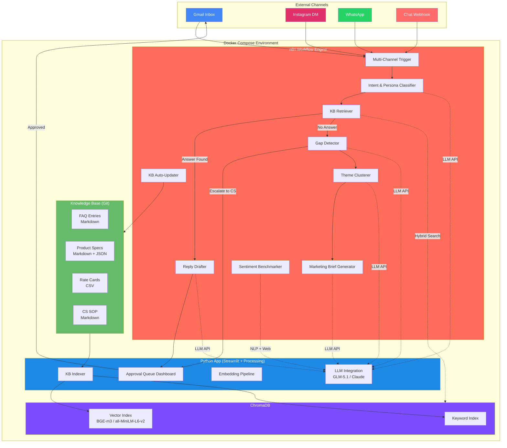
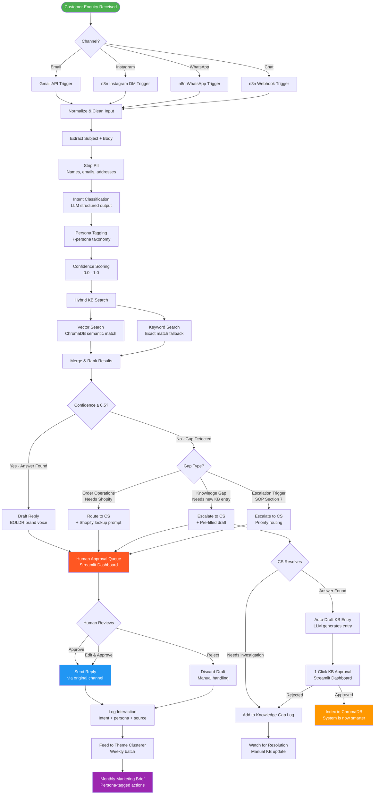
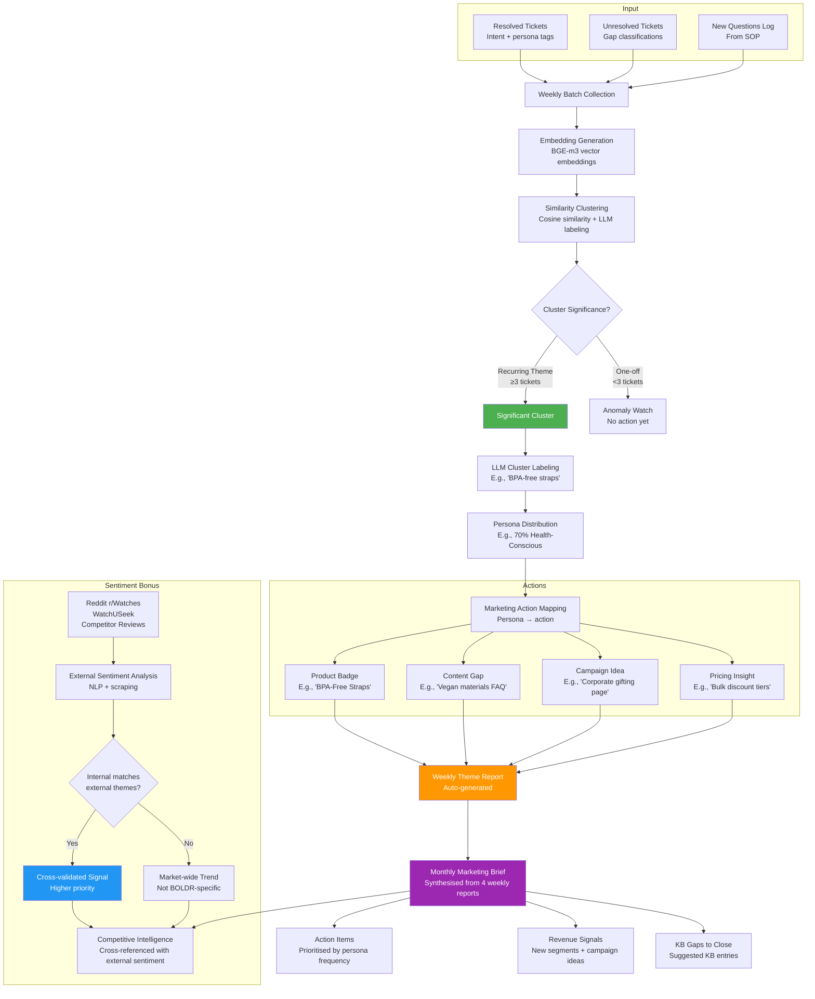
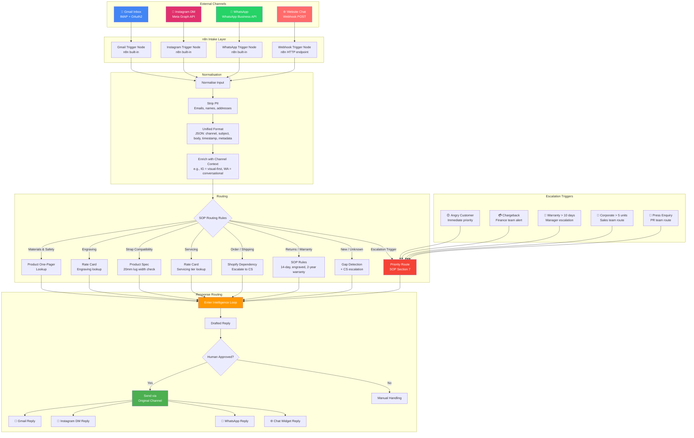
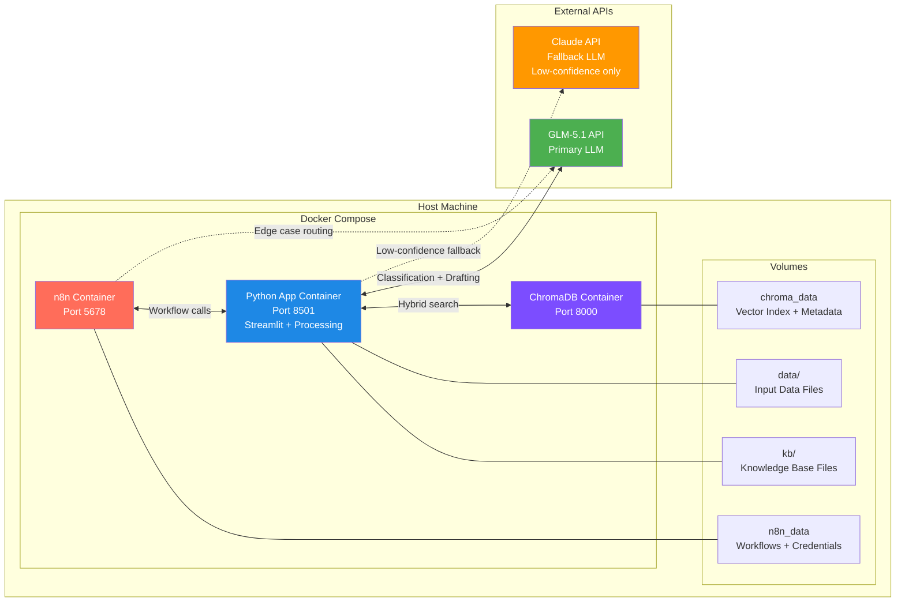
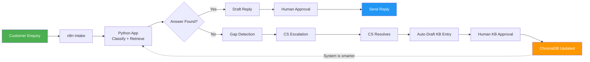

# BOLDR — Architecture Documentation

**Project:** BOLDR — Self-Improving Customer Intelligence Engine  
**Track:** REVENUE ROCKET — Sales, Marketing, and Customer Acquisition  
**Author:** Steve Ng, Founder and CEO — Digital Futures Consultancy LLP  
**Date:** 2026-05-17

---

## 1. System Architecture

The BOLDR Intelligence Engine is a containerised, self-hosted system with three core services orchestrated by Docker Compose.

### Component Summary

| Component | Technology | Role | Docker Image |
|---|---|---|---|
| **Workflow Engine** | n8n (self-hosted) | Orchestrates the entire intelligence loop | `n8nio/n8n:latest` |
| **Vector Store** | ChromaDB | Stores and retrieves KB document embeddings | `chromadb/chroma:latest` |
| **LLM** | GLM-5.1 (API) + Claude (fallback) | Classification, drafting, clustering, gap detection | Cloud API (no container) |
| **Embedding** | BGE-m3 / all-MiniLM-L6-v2 | Document and query embedding | Built into Python app |
| **App Server** | Python 3.12 + Streamlit | Dashboard, KB processing, approval queues | `python:3.12-slim` (custom) |
| **Knowledge Base** | Markdown + JSON + CSV | Source documents, version-controlled in Git | Volume mount |

---

## 2. Data Flow — Ticket Processing Pipeline

This diagram shows the complete journey of a customer ticket from intake to resolution.

### Decision Points

| Decision | Logic | Routing |
|---|---|---|
| **Confidence ≥ 0.5?** | Hybrid retrieval confidence score | Yes → Draft reply. No → Gap detection. |
| **Gap type?** | SOP-derived classification | Order ops → Shopify prompt. Knowledge gap → CS escalation. Escalation trigger → Priority routing. |
| **Human review?** | All drafted replies require human approval | Approve/Edit → Send. Reject → Manual handling. |
| **KB approval?** | Auto-drafted KB entries require human approval | Approved → Index in ChromaDB. Rejected → Pending investigation. |

---

## 3. KB Update Loop — Gap Detection to Knowledge Growth

This diagram shows how knowledge gaps are detected, resolved, and fed back into the system.

```mermaid
flowchart LR
    subgraph Detection
        A[Low-Confidence<br/>KB Retrieval] --> B[Gap Detector<br/>LLM Classification]
        B --> C{Gap Type?}
        C -->|Order Operations| D[Shopify Dependency<br/>Not a KB gap]
        C -->|Knowledge Gap| E[True KB Gap]
        C -->|Escalation Trigger| F[SOP Rule<br/>Priority Escalation]
    end
    
    subgraph Resolution
        E --> G[CS Team Resolves<br/>Manually]
        G --> H[Resolution Documented<br/>Answer + sources]
        D --> I[CS Team Handles<br/>+ Shopify lookup]
        I --> J[Optional: Create<br/>Order FAQ KB entry]
        F --> K[CS Team Handles<br/>Per SOP protocol]
    end
    
    subgraph Auto-Draft
        H --> L[LLM Auto-Drafts<br/>KB Entry]
        L --> M[Pre-filled Template<br/>Title + content + sources + tags]
        M --> N[1-Click Approval<br/>Streamlit Dashboard]
        N -->|Approved| O[KB Entry Committed<br/>Markdown + JSON]
        N -->|Edit & Approve| P[Modified Entry<br/>Committed]
        N -->|Reject| Q[Discarded<br/>Gap stays in log]
    end
    
    subgraph Indexing
        O --> R[Parse & Chunk<br/>KB Indexer]
        P --> R
        R --> S[Generate Embeddings<br/>BGE-m3 / all-MiniLM]
        S --> T[Index in ChromaDB<br/>Vector + keyword]
        T --> U([System Now Smarter<br/>Gap Closed!])
    end
    
    subgraph Version Control
        O --> V[Git Commit<br/>KB version history]
        P --> V
        V --> W[Diff View Available<br/>Rollback capability]
        W --> X[Approval Timestamp<br/>+ Editor logged]
    end
    
    style U fill:#4CAF50,color:#fff
    style T fill:#7C4DFF,color:#fff
    style O fill:#FF9800,color:#fff
    style N fill:#FF5722,color:#fff
```

### Gap Classification Logic

| Gap Type | Signal | Action | KB Update? |
|---|---|---|---|
| **Order Operations** | Order tracking, shipping, refunds, address changes | Route to CS with Shopify lookup prompt | Optional (FAQ-style entry) |
| **True Knowledge Gap** | Product specs, sustainability, niche compatibility | Escalate to CS, auto-draft KB entry on resolution | Yes — auto-drafted |
| **Escalation Trigger** | Angry customer, chargeback, warranty >10 days, corporate >5 units, press | Priority route per SOP Section 7 | No — handled per protocol |

### Confidence Threshold

| Confidence Score | Range | Action |
|---|---|---|
| **High** | 0.8–1.0 | Auto-draft reply with source citation |
| **Medium** | 0.5–0.79 | Draft reply, flag for careful review |
| **Low** | 0.3–0.49 | Route to gap detection, provide pre-filled draft to CS |
| **Very Low** | 0.0–0.29 | Route directly to CS, no draft attempt |

---

## 4. Theme Clustering Pipeline

This diagram shows how unresolved tickets are clustered into themes and surfaced as marketing intelligence.

### Persona-to-Action Mapping

| Buyer Persona | Recurring Theme | Marketing Action |
|---|---|---|
| Health-Conscious | BPA-free straps, nickel allergy, skin reactions | Add "BPA-Free" & "Hypoallergenic" product badges |
| Gifter | Engraving options, gift wrap, birthday urgency | Create "Gift Guide" landing page with engraving upsell |
| Enthusiast | Strap compatibility, model specs, swimming suitability | Build "Compatibility Checker" tool on product pages |
| Niche Buyer | Magnetic fields, altitude, extreme sports, collaborations | Develop "Technical Specs" deep-dive content |
| Owner Aftercare | Servicing older models, regulation, battery replacement | Publish "Watch Care" guide + servicing FAQ |
| Prospect | Price matching, model comparison, warranty | Add comparison table + warranty FAQ |
| Transactional | Order tracking, shipping, refunds | Improve order status page + shipping FAQ |

### Anomaly Detection

| Signal | Threshold | Action |
|---|---|---|
| **Volume spike** | Theme count > 2× weekly average | Immediate alert (don't wait for monthly brief) |
| **New theme** | Cluster not seen in previous 4 weeks | Flag for CS team review |
| **Escalation cluster** | 3+ escalations on same theme in 1 week | Priority KB update + SOP review |

---

## 5. Multi-Channel Intake Architecture

This diagram shows how enquiries from different channels are ingested, normalised, and routed into the intelligence loop.

### Channel Characteristics

| Channel | Volume | Tone | Key Consideration |
|---|---|---|---|
| **Gmail** | 18/70 (26%) | Formal, detailed | Full email thread context; attachments possible |
| **Instagram DM** | 19/70 (27%) | Casual, visual-first | Short messages; may reference images |
| **WhatsApp** | 16/70 (23%) | Conversational, urgent | Real-time expectation; shorter response window |
| **Chat** | 17/70 (24%) | Mixed, task-focused | Mid-conversation context; may have browsing history |

### PII Handling Per Channel

| Channel | PII Collected | PII Stripped | Stored? |
|---|---|---|---|
| **Gmail** | Name, email address, phone (in signature) | Email address, phone, full name | No — only intent + persona tags |
| **Instagram DM** | IG handle, display name | IG handle, display name | No — only intent + persona tags |
| **WhatsApp** | Phone number, display name | Phone number, display name | No — only intent + persona tags |
| **Chat** | Session ID, optional name | Session ID, name | No — only intent + persona tags |

---

## 6. Deployment Architecture

### Service Dependencies

| Service | Depends On | Health Check |
|---|---|---|
| **n8n** | ChromaDB, App | `wget http://localhost:5678/healthz` |
| **App** | ChromaDB | `requests.get('http://localhost:8501/_stcore/health')` |
| **ChromaDB** | None (standalone) | `curl http://localhost:8000/api/v1/heartbeat` |

### Data Flow Summary

---

*Prepared by Digital Futures Consultancy LLP for ECHELON 2026 AI Workflow Competition*